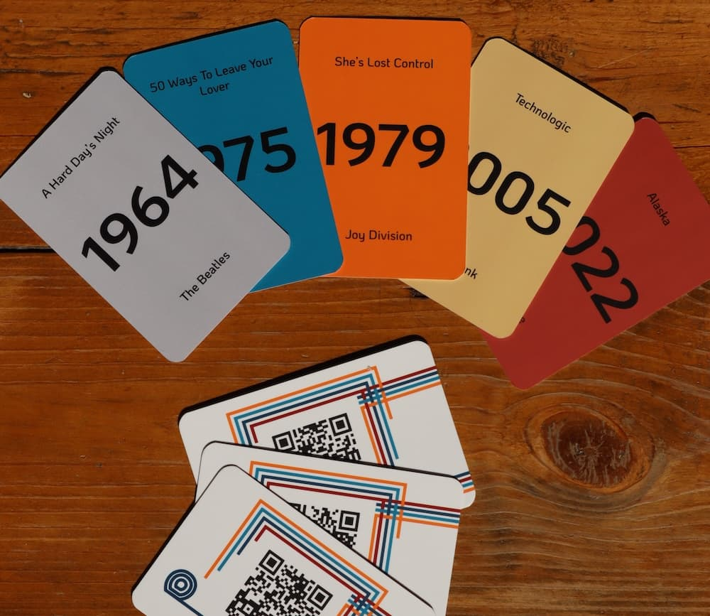

# Accentor Game aka Charlotte's Song

Charlotte's Song is a small card game that requires you to identify music from your own collection.

## Why use Accentor?

Accentor gives you complete control over your music. You can build
your own collection (with good old CD's, bandcamp downloads, ...) in
the sound quality that you want and stream it either through the [web
frontend](https://github.com/accentor/web) or the [android app](https://github.com/accentor/android).

Accentor is focused on metadata. We allow you to add detailed metadata
to your music collection, beyond what the tags inside an audio file
are capable of. Album and tracks can have multiple artists with a
different name on different albums/tracks, albums can have multiple
labels and tracks can have multiple genres.

The metadata is completely in your control: you can edit it however you want.

## How to deploy

To use the web frontend, you already need to have an API running. You
can read how to do that [here](https://github.com/accentor/api).

### Use a hosting service for static sites

The project can be deployed to a static site hoster like Netlify.
You only need the following three things:
* An environment variable for `VITE_API_URL` pointing to the domain of your api.
* Build command: `npm run build`.
* Output directory: `dist/`.

If at some point the trackID on a card is no longer valid (because the track has been merged),
you can deploy the project with the `VITE_TRACK_MAP` environment variable and provide the old
and new trackID. This expects the trackIDs in the following format: `OLD_ID1:NEW_ID1;OLD_ID2:NEW_ID2`.

## Local development

To run and develop locally:
1. Install all dependencies with `npm install`.
2. Compile with hot-reloads using `npm run dev`.

You will also need an API to interact with. For this you can
* [Run the API locally](https://github.com/accentor/api) (Recommended)
* Set an environment variable for `VITE_API_URL` pointing to an
  existing API.

## Creating cards
Cards to play this game should have an QR-code on one side and the song's info on the other.

The QR-code should contain a base64 encoded reference a track's id. You can generate the content for the QR-code using [this ruby script](./scripts/prepare_qr_codes.rb).

## Help

Have a question? You can ask it through [GitHub
discussions](https://github.com/accentor/web/discussions) or in the
[Matrix channel](https://matrix.to/#/!PCYHOaWItkVRNacTSv:vanpetegem.me?via=vanpetegem.me&via=matrix.org).

Think you have noticed a bug or have a great idea for a feature?
[Create an issue](https://github.com/accentor/game/issues).

